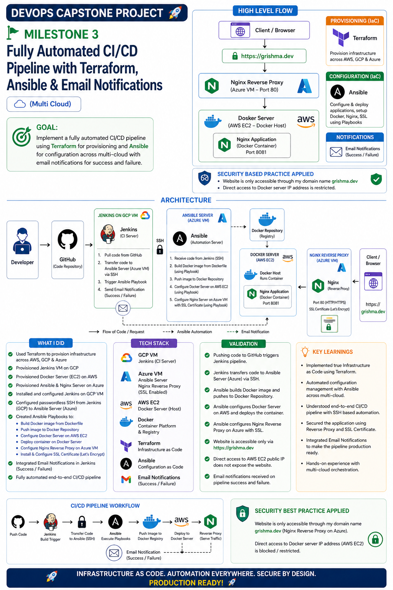

# 🚀 DevOps Capstone Project – Milestone 3

## 📌 Fully Automated CI/CD Pipeline with IAC Tools

This milestone focuses on building a fully automated multi-cloud DevOps pipeline using **Terraform**, **Ansible**, **Jenkins**, **Docker**, and **Nginx Reverse Proxy**.

The project introduces **Infrastructure as Code (IaC)** for provisioning, **Configuration as Code (CaC)** for deployment automation, SSL-enabled secure access, and email notifications for production-ready CI/CD workflows.

---

## 📸 Architecture Overview

<p align="center">
  
</p>

---

## 🎯 Goal

Implement a fully automated CI/CD pipeline that:

- Provisions infrastructure using Terraform
- Configures servers using Ansible
- Builds and deploys Docker containers automatically
- Implements SSL-secured access
- Enables email notifications for pipeline events
- Uses a multi-cloud architecture across AWS, Azure, and GCP

---

## 🏗️ Architecture

```text
Developer
    │
    ▼
GitHub
    │
    ▼
Jenkins (GCP VM)
    │ SSH
    ▼
Ansible Server (Azure VM)
    │
    ▼
Docker Repository
    │
    ▼
Docker Host (AWS EC2)
    │
    ▼
Nginx Reverse Proxy (Azure VM)
    │
    ▼
Browser (https://grishma.dev)
```

---

## ⚙️ Tech Stack

- **GitHub** – Source Code Repository
- **Jenkins** – CI/CD Automation Server
- **Terraform** – Infrastructure as Code (IaC)
- **Ansible** – Configuration Management & Automation
- **Docker** – Container Platform
- **Nginx** – Reverse Proxy & SSL Termination
- **AWS EC2** – Docker Host
- **Azure VM** – Ansible Server & Reverse Proxy
- **GCP VM** – Jenkins Server
- **Let's Encrypt** – SSL Certificate Provider
- **Gmail Notifications** – Build Success/Failure Alerts
- **Ubuntu 22.04 LTS** – Operating System

---

## 🔧 What I Did

### Infrastructure Provisioning

- Used Terraform to provision infrastructure
- Created resources across AWS, Azure, and GCP
- Automated infrastructure deployment process

### Jenkins Server (GCP VM)

- Installed and configured Jenkins
- Connected Jenkins with GitHub repository
- Configured CI/CD pipeline automation
- Integrated email notification system

### Ansible Automation Server (Azure VM)

- Installed and configured Ansible
- Configured passwordless SSH access from Jenkins
- Created reusable Ansible Playbooks
- Automated application deployment process

### Docker Host (AWS EC2)

- Installed Docker Engine
- Configured Docker Host using Ansible
- Pulled Docker images from Docker Repository
- Deployed and managed application containers

### Docker Image Automation

- Built Docker image using Dockerfile
- Automated image creation through Ansible
- Pushed Docker image to Docker Repository
- Automated container deployment

### Reverse Proxy & SSL

- Configured Nginx Reverse Proxy on Azure VM
- Forwarded traffic to Docker container running on AWS
- Installed SSL Certificate using Let's Encrypt
- Enabled HTTPS access through grishma.dev

### Email Notifications

- Configured build success notifications
- Configured build failure notifications
- Improved monitoring and deployment visibility

---

## 🔁 CI/CD Workflow

1. Developer pushes code to GitHub
2. Jenkins detects code changes
3. Jenkins transfers code to Ansible Server
4. Ansible executes deployment Playbooks
5. Docker image is built automatically
6. Image is pushed to Docker Repository
7. AWS Docker Host pulls latest image
8. Container is deployed automatically
9. Nginx Reverse Proxy forwards HTTPS traffic
10. Email notification is sent for pipeline result

---

## 🌐 Request Flow

```text
Client Browser
      │
      ▼
https://grishma.dev
      │
      ▼
Nginx Reverse Proxy (Azure VM)
      │
      ▼
Docker Host (AWS EC2)
      │
      ▼
Nginx Application Container (Port 8081)
```

---

## ✅ Validation

- GitHub push automatically triggers Jenkins pipeline
- Jenkins successfully communicates with Ansible Server
- Ansible builds Docker image and pushes to repository
- AWS Docker Host pulls and deploys container successfully
- Nginx Reverse Proxy serves traffic correctly
- SSL certificate configured successfully
- Website accessible only through HTTPS
- Direct access to AWS server IP restricted
- Email notifications received on build success and failure
- End-to-end automated deployment pipeline working successfully

---

## 💡 Key Learnings

- Infrastructure as Code using Terraform
- Configuration Management using Ansible
- Multi-cloud infrastructure orchestration
- SSH-based automation workflows
- Docker deployment automation
- Jenkins pipeline automation
- Reverse Proxy configuration
- SSL certificate management
- Production-ready deployment practices
- Monitoring through email notifications
- End-to-end DevOps automation

---

## 🔒 Security Best Practices Applied

- SSL Certificate enabled using Let's Encrypt
- HTTPS-only access via grishma.dev
- Reverse Proxy acts as secure entry point
- Docker Host not directly exposed to users
- Automated infrastructure and configuration management
- Restricted direct access to AWS Docker Host

---

## 🔗 Repository Info

- **Repo:** https://github.com/grishma2477/devOps-milestone
- **Branch:** `mile3`

---

## 🚀 Next Step

➡️ Moving to **Milestone 4: Kubernetes Deployment & Container Orchestration**

---

## 👩‍💻 Author

**Grishma Kandel**  
Cloud & DevOps Engineer | MERN Stack Developer  
📍 Sydney, Australia

---

⭐ This milestone provided hands-on experience with Terraform, Ansible, Jenkins, Docker, SSL Certificates, Infrastructure as Code, Configuration Management, and fully automated multi-cloud CI/CD pipelines, helping build production-ready DevOps skills.